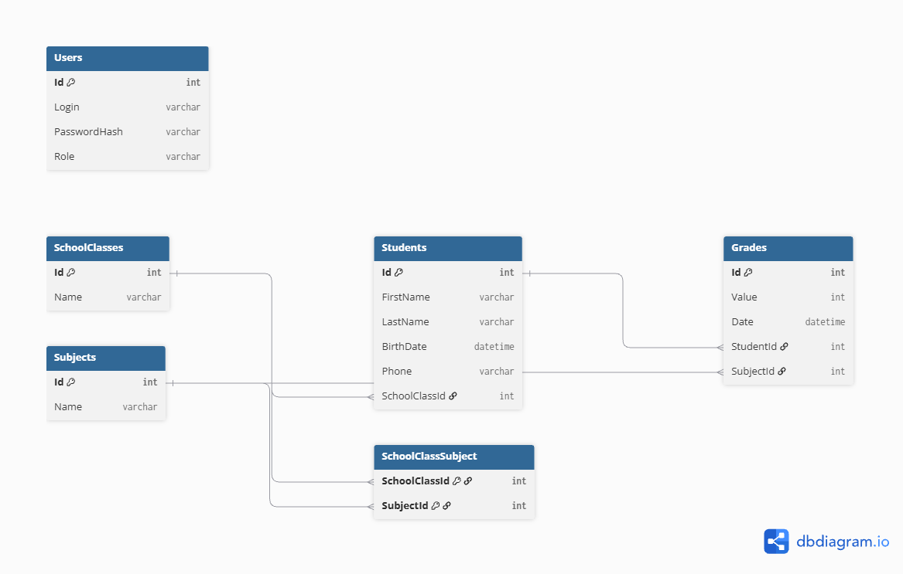

# Школа - учебный проект на C# / .NET 8

Это мой учебный проект - веб-приложение для управления данными школы: ученики, классы, предметы и оценки. Делал на C# и .NET 8, с многослойной (N-tier) архитектурой и MS SQL Server в качестве базы данных.

## Стек технологий

- C#, .NET 8, ASP.NET Core
- Blazor Web App (Interactive Server) - для UI
- Microsoft SQL Server (Developer Edition)
- Entity Framework Core 8 (Code First)
- xUnit + Moq - для юнит-тестов
- Cookie-based аутентификация, роли Admin / Teacher

## Архитектура

Проект разбит на 4 слоя (N-tier), каждый в своём проекте:

- **School.Domain** - модели (Student, SchoolClass, Subject, Grade, User), без зависимостей от остальных слоёв
- **School.Data** - EF Core: DbContext, миграции, репозитории
- **School.Services** - бизнес-логика и валидация, расчёт среднего балла
- **School.Web** - сам Blazor UI
- **School.Tests** - юнит-тесты на сервисы

Зависимости идут строго в одну сторону: Web → Services → Data → Domain.

## Схема базы данных

База нормализована (3НФ), 5 основных таблиц + одна промежуточная для связи многие-ко-многим между классами и предметами:

- **Students** - ученики (связь с SchoolClasses, многие-к-одному)
- **SchoolClasses** - классы
- **Subjects** - предметы (многие-ко-многим с SchoolClasses через SchoolClassSubject)
- **Grades** - оценки (связаны со Students и Subjects)
- **Users** - пользователи системы



## Что умеет приложение

- Ученики: добавление, редактирование, удаление, фильтр по классу и фамилии
- Классы: создание, просмотр состава, привязка предметов
- Предметы: список, привязка к классам
- Журнал оценок: оценки по 10-балльной шкале, средний балл по каждому предмету и общий средний, фильтр по периоду
- Вход/регистрация с ролями - удалять данные может только Admin
- Логирование действий через ILogger

## Что нужно для запуска

- Visual Studio 2022+ с рабочей нагрузкой "ASP.NET и веб-разработка"
- .NET 8 SDK
- Microsoft SQL Server (полная версия, не LocalDB)
- SSMS - по желанию

## Как запустить

### 1. Клонируем репозиторий

```
git clone https://github.com/mihailovp04-projects/school_project.git
cd school_project
```

### 2. Строка подключения

В `School.Web/appsettings.json` сделать под свой сервер:

```json
"ConnectionStrings": {
  "SchoolDb": "Server=localhost;Database=SchoolDb;Trusted_Connection=True;TrustServerCertificate=True;"
}
```

### 3. Миграции

В Package Manager Console (Visual Studio):

```
Update-Database -Project School.Data -StartupProject School.Web
```

Создаст базу `SchoolDb` со всеми таблицами.

### 4. Запуск

Стартовый проект - **School.Web**, дальше **F5** (или **Ctrl+F5** без отладчика). Откроется в браузере, что-то вроде `https://localhost:7266`.

### 5. Первый пользователь

Пользователей в базе сначала нет. Идём на `/register` и регистрируемся - первый зарегистрированный автоматически становится **Admin**, все следующие - **Teacher**.

## Тесты

Тест → Обозреватель тестов → Запустить все. Всего 28 тест на валидацию и логику сервисов.

## Структура

```
School/
├── School.Domain/          # модели
├── School.Data/             # EF Core, репозитории, миграции
├── School.Services/         # бизнес-логика
├── School.Web/               # Blazor UI
├── School.Tests/             # тесты
└── docs/
    └── er-diagram.png        # ER-диаграмма
```
